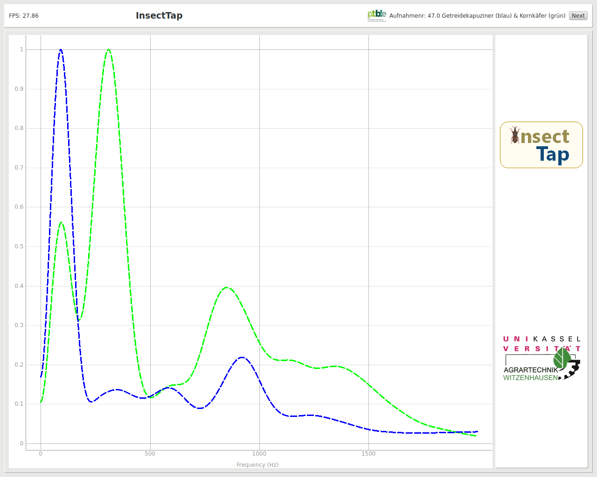

# bugshow.py

An audiovisual  data show about sound gathered from grain weevils combined with some audiomonitoring capabilities for use on an raspi with display.  
Made for [University of Kassel faculty ecological agricultural sciences department agricultural engineering](http://www.uni-kassel.de/fb11agrar/de/fachgebiete-einrichtungen/agrartechnik/startseite.html?c=1).

Copy left by [Johannes Winter](https://github.com/y0va) with many thanks to: [SWHarden](http://www.swharden.com/wp/2016-07-31-real-time-audio-monitor-with-pyqt/) and [boylea](https://gist.github.com/boylea)

